<!--
  GitHub Profile README
  Owner: Hesara Liyanage
  Username: cptdihindu
-->

<!-- HERO SECTION -->

<p align="center">
  
</p>

<p align="center">
  <a href="https://git.io/typing-svg">
    
  </a>
</p>

<p align="center">
  
  
  
</p>

<p align="center">
  <a href="https://www.linkedin.com/in/hesara-liyanage">
    
  </a>
  <a href="https://github.com/cptdihindu">
    
  </a>
  <a href="https://mail.google.com/mail/?view=cm&fs=1&to=liyanagedihindu@gmail.com">
    
  </a>
</p>

---

<!-- ABOUT SECTION -->

<h2 align="center">🚀 About Me</h2>

<table>
<tr>
<td width="58%" valign="top">

### 👋 Hey, I'm Hesara

I'm an **Information Systems undergraduate** interested in building practical software systems and learning how to deploy, automate, monitor, and scale them.

- 🎓 BSc Information Systems Undergraduate at **UCSC**
- 💻 Interested in **Software Engineering, DevOps, and Cloud Engineering**
- 🛠️ Building full-stack applications with **Next.js, React, NestJS, FastAPI, PostgreSQL, and Docker Compose**
- 🐧 Strengthening my foundation in **Linux, networking, system administration, and deployments**
- ⚙️ Currently learning **CI/CD, AWS, Terraform, Kubernetes, and monitoring**
- 🎯 Goal: become a **DevOps Engineer**

</td>
<td width="42%" align="center" valign="top">



</td>
</tr>
</table>

---

<!-- CURRENT FOCUS -->

<h2 align="center">🎯 Current Focus</h2>

<p align="center">
  
  
  
  
  
  
</p>

```text
Linux Administration  █████████░  Strong foundation
Docker / Compose      ████████░░  Building practical projects
CI/CD                 █████░░░░░  Learning GitHub Actions
AWS Cloud             ████░░░░░░  Learning fundamentals
Terraform             ███░░░░░░░  Next target
Kubernetes            ██░░░░░░░░  After Docker + CI/CD
```

---

<!-- TECH STACK -->

<h2 align="center">🧰 Tech Stack</h2>

<h3 align="center">Languages</h3>

<p align="center">
  
</p>

<h3 align="center">Frontend</h3>

<p align="center">
  
</p>

<h3 align="center">Backend</h3>

<p align="center">
  
</p>

<h3 align="center">Databases</h3>

<p align="center">
  
</p>

<h3 align="center">DevOps, Tools & Infrastructure</h3>

<p align="center">
  
</p>

<p align="center">
  <b>Note:</b> AWS, Terraform, and Kubernetes are part of my active DevOps learning roadmap.
</p>

---

<!-- FEATURED PROJECTS -->

<h2 align="center">🔥 Featured Projects</h2>

<table>
<tr>
<td width="50%" valign="top">

<h3>📄 MarkdownForge / mdToPdf</h3>

<p>
  
  
  
</p>

Browser-based Markdown editor and PDF/document generation platform.

<b>Tech:</b> JavaScript, Python, FastAPI, Playwright, CodeMirror, Marked.js

<b>Highlights:</b>

- Live Markdown editing and preview
- PDF generation workflow
- Browser-based document creation
- Practical full-stack project foundation

<br/>

<a href="https://github.com/cptdihindu/mdToPdf">
  
</a>

</td>
<td width="50%" valign="top">

<h3>🚚 SwiftTrack Middleware Architecture</h3>

<p>
  
  
  
</p>

Middleware architecture for logistics system integration.

<b>Tech:</b> JavaScript, Python, Node.js, Express.js, Flask, PostgreSQL, RabbitMQ, Docker, WebSockets

<b>Highlights:</b>

- API Gateway
- Microservices architecture
- REST, SOAP, TCP/IP, WebSockets
- RabbitMQ publish/subscribe messaging

<br/>

<a href="https://github.com/cptdihindu/Middleware-Architecture-for-SwiftLogistics-">
  
</a>

</td>
</tr>

<tr>
<td width="50%" valign="top">

<h3>🐾 PetVet</h3>

<p>
  
  
  
</p>

Veterinary clinic management system built for clinic and pet-service operations.

<b>Tech:</b> PHP, HTML, CSS, JavaScript, MySQL

<b>Highlights:</b>

- Web-based clinic service platform
- PHP backend functionality
- Database-backed workflows
- Group project experience

<br/>

<a href="https://github.com/petvet-pvt-ltd/PETVET">
  
</a>
<a href="https://github.com/cptdihindu/PETVET-MVC">
  
</a>

</td>
<td width="50%" valign="top">

<h3>📡 Python Pub/Sub Middleware</h3>

<p>
  
  
  
</p>

Python socket-based Publish/Subscribe middleware implementation with client-server communication.

<b>Tech:</b> Python, Sockets, Client-Server Architecture

<b>Highlights:</b>

- Publisher/subscriber roles
- Topic-based message filtering
- Socket communication
- Middleware concept practice

<br/>

<a href="https://github.com/cptdihindu/python-pubsub-middleware">
  
</a>

</td>
</tr>

<tr>
<td width="50%" valign="top">

<h3>✅ TodoListApp</h3>

<p>
  
  
  
</p>

Simple full-stack Todo List web app with API and database integration.

<b>Tech:</b> React, ASP.NET Core Web API, Entity Framework Core, SQLite

<b>Highlights:</b>

- Frontend and backend separation
- REST API practice
- Database integration
- CRUD application structure

<br/>

<a href="https://github.com/cptdihindu/TodoListApp">
  
</a>

</td>
<td width="50%" valign="top">

<h3>📅 Student Timetable Optimiser</h3>

<p>
  
  
  
</p>

Java console app for importing class CSVs and generating clash-free student timetables.

<b>Tech:</b> Java, CSV, Scheduling Logic

<b>Highlights:</b>

- CSV import/export
- Timetable generation
- Clash-free scheduling
- Preference scoring

<br/>

<a href="https://github.com/cptdihindu/StudentTimetableOptimiser">
  
</a>

</td>
</tr>
</table>

---

<!-- DEVOPS LABS -->

<h2 align="center">🛠️ DevOps / System Administration Labs</h2>

<table>
<tr>
<td width="50%" valign="top">

<h3>🐧 Linux Administration</h3>

- DNF package and repository management
- Boot recovery using GRUB emergency shell
- `/etc/fstab`, LVM, XFS quotas
- systemd services, cron jobs, logs, and resource limits

</td>
<td width="50%" valign="top">

<h3>🌐 Networking & Infrastructure</h3>

- DHCP, routing, IP forwarding, NAT
- nftables masquerade
- tcpdump and conntrack troubleshooting
- BIND9 DNS and DNSSEC lab setup

</td>
</tr>

<tr>
<td width="50%" valign="top">

<h3>📦 Containers</h3>

- Built containers manually using namespaces
- Used chroot, cgroup v2, bridge networking, and veth pairs
- Practiced core concepts behind Docker/Podman

</td>
<td width="50%" valign="top">

<h3>⚖️ High Availability</h3>

- Keepalived/VRRP virtual IP failover
- Squid reverse proxy/load balancing
- Tomcat backend servers
- MySQL firewall restriction and TLS verification

</td>
</tr>
</table>

---

<!-- GITHUB ANALYTICS -->

<h2 align="center">📊 GitHub Analytics</h2>

<p align="center">
  
  
</p>

<p align="center">
  
</p>

<p align="center">
  
</p>

<h3 align="center">🏆 GitHub Highlights</h3>

<p align="center">
  
  
  
</p>

---

<!-- CONTRIBUTION SNAKE -->

<h2 align="center">🐍 Contribution Snake</h2>

<p align="center">
  <picture>
    <source 
      media="(prefers-color-scheme: dark)" 
      srcset="https://raw.githubusercontent.com/cptdihindu/cptdihindu/output/github-contribution-grid-snake-dark.svg"
    >
    <source 
      media="(prefers-color-scheme: light)" 
      srcset="https://raw.githubusercontent.com/cptdihindu/cptdihindu/output/github-contribution-grid-snake.svg"
    >
    
  </picture>
</p>

---

<!-- ROADMAP -->

<h2 align="center">🧭 My Engineering Roadmap</h2>

<table align="center">
<tr>
<td align="center" width="120">
  
  <br/>
  <b>Linux</b>
</td>
<td align="center" width="120">
  
  <br/>
  <b>Docker</b>
</td>
<td align="center" width="120">
  
  <br/>
  <b>CI/CD</b>
</td>
<td align="center" width="120">
  
  <br/>
  <b>AWS</b>
</td>
<td align="center" width="120">
  
  <br/>
  <b>Terraform</b>
</td>
<td align="center" width="120">
  
  <br/>
  <b>Kubernetes</b>
</td>
</tr>
</table>

---

<!-- COLLAPSIBLE FUTURE-PROOF SECTIONS -->

<details>
<summary><b>📚 More About My DevOps Learning Path</b></summary>

<br/>

I'm working toward becoming confident in the full DevOps lifecycle:

- Linux administration and troubleshooting
- Dockerized application deployment
- CI/CD pipelines with GitHub Actions
- Cloud fundamentals with AWS
- Infrastructure as Code with Terraform
- Kubernetes application deployment
- Monitoring, logging, backups, and incident handling

</details>

<br/>

<details>
<summary><b>🧪 Practical Areas I Like Working On</b></summary>

<br/>

- Backend APIs
- Database-backed applications
- Linux servers
- Automation scripts
- Docker Compose environments
- Networking labs
- Deployment workflows
- System troubleshooting

</details>

<br/>

<details>
<summary><b>🚀 Future Portfolio Improvements</b></summary>

<br/>

Planned improvements for this GitHub profile and portfolio:

- Add public deployment links for major projects
- Add CI/CD badges to project repositories
- Add Dockerized deployment guides
- Add Terraform-based AWS deployment lab
- Add monitoring dashboard screenshots
- Add technical blog posts and project writeups

</details>

---

<!-- CONTACT -->

<h2 align="center">🤝 Connect With Me</h2>

<p align="center">
  <a href="https://www.linkedin.com/in/hesara-liyanage">
    
  </a>
  <a href="https://github.com/cptdihindu">
    
  </a>
</p>

<p align="center">
  <a href="https://mail.google.com/mail/?view=cm&fs=1&to=liyanagedihindu@gmail.com">
    
  </a>
</p>

---

<!-- FOOTER -->

<p align="center">
  
</p>

<p align="center">
  <i>"Building the bridge between software engineering and reliable infrastructure."</i>
</p>
